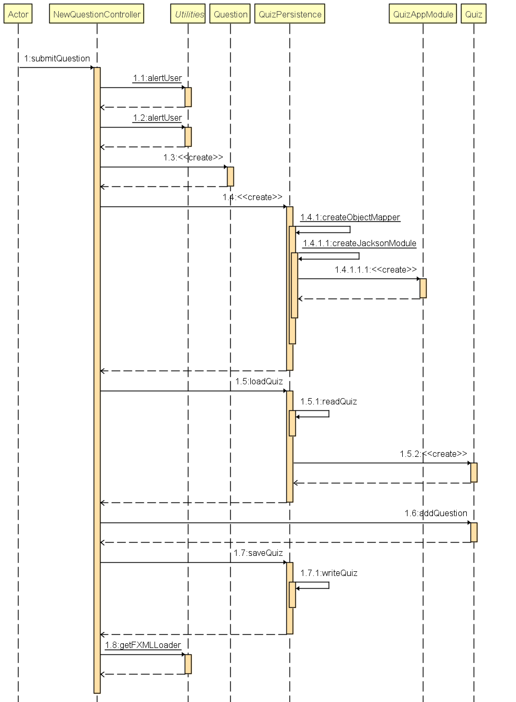
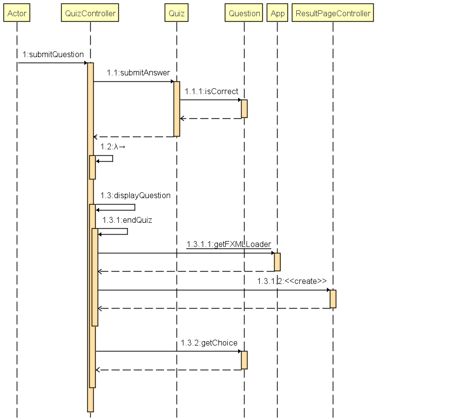
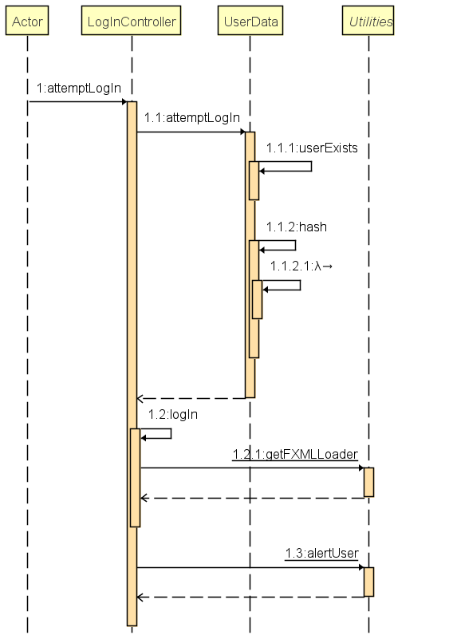
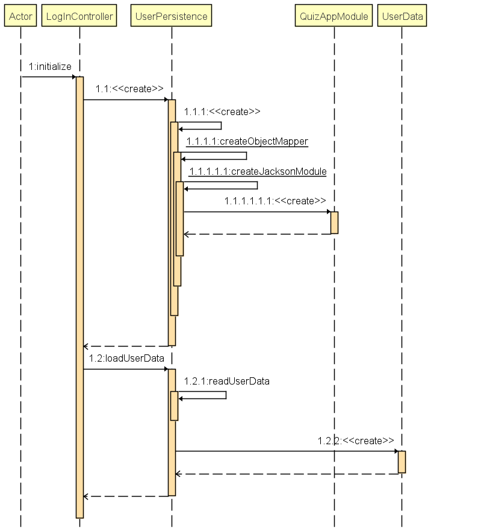

<!-- PROJECT LOGO -->
[](https://gitlab.stud.idi.ntnu.no/it1901/groups-2021/gr2114/gr2114/-/commits/main)
[](https://gitlab.stud.idi.ntnu.no/it1901/groups-2021/gr2114/gr2114/-/commits/main)
<h1 align="center">Quiz App</h1>

<!-- TABLE OF CONTENTS -->
<details open="open">
  <summary><h2 style="display: inline-block">Table of Contents</h2></summary>
  <ol>
    <li>
      <a href="#about-the-project">Project Structure</a>
      <ul>
        <li><a href="#built-with">Built With</a></li>
      </ul>
    </li>
    <li>
      <a href="#getting-started">Getting Started</a>
      <ul>
        <li><a href="#installation">Installation</a></li>
      </ul>
    </li>
    <li>
        <a href="#Core">Core</a>
        <ul>
            <li><a href="#core">core</a></li>
            <li><a href="#io">io</a></li>
        </ul>
    </li>
    <li>
        <a href="#UI">UI</a>
        <ul>
            <li><a href="#ui">ui</a></li>
            <li><a href="#resources">Resources</a></li>
        </ul>
    </li>
    <li><a href="#contact">Contact</a></li>
  </ol>
</details>


<!-- ABOUT THE PROJECT -->

## Project Structure

<p>
The project is seperated into modules; the core and the ui. The core module contains classes that handle logic and app functionality, and has no direct impact on the users communication with the app. The ui module howewer, contains classes and resources that handle the GUI presented to the user.
</p>

### Built With

* Java
* JavaFX
* Maven
* Json and Jackson
* Jacoco
* Checkstyle
* Spotbugs
* Spring boot
* Jpackage and jlink
* Tomcat

#### Checkstyle settings
We use a default checkstyle template, with minor changes:
- Line length: We think that the line lenght restriction in the template is a bit to strict so we have upped it to 120
- End Of Line Operator: We specified that operators should be at end of line rather than the start, due to IntelliJ formattiing.
- Hidden Field: We disabed this check because we think that the this.field syntax is useful and clean
- Magic number: We changed this from error to warning, because we want them in some cases, but seldomly.
- Javadoc Grammar: We disabled grammar checks in javadoc, because this is unimportant

#### Spotbugs settings
We have edited a few spotbugs settings:
- Disabled unused field in controllers that arent linked to a FXML file, because the fields are used but the compiler doesn't understand it

#### Jlink
The JLink goal is intended to create a Java Run Time Image. Description of a few of the parameters we use
- MainClass: What main needs to be launched by specifying module, package and class. We set it to ui.App since the application is in the UI module. 
- Compress: Enables compression of resources, we set to 2 for compressing to ZIP
- StripDebug: Excludes JRE debug information
- noManPages: Excludes the JDK docs
- Launcher: The executable name
#### JPackage
- Name: Set the name ofthe application
- Destination: Sets the destination folder for the generated package 
- Module: Set the module and the main class of our application since JPackage will generate a new executable for our package 
- Runtimeimage: We set the parameter to target/quizfx to macth the path of the jlink Runtimeimage


<!-- GETTING STARTED -->

## Getting Started

To get a local copy up and running follow these simple steps.

* Run the app from terminal
  ```sh
  mvn clean install
  ```

* Run tests and test coverage
  ```sh
  mvn verify
  ```
* Run the server
  ```sh
  mvn spring-boot:run -pl rest
  ```
* Create a shippable application in GitPod
  ```sh
  sudo apt update && sudo apt install fakeroot
  mvn clean compile javafx:jlink jpackage:jpackage -pl ui
  sudo apt install ./target/dist/quizfx_1.0.0-1_amd64.deb
  ```
  Now the program can be found in /opt/quizfx/

* Run the application created by jpackage 
  ```sh
  /opt/quizfx/bin/quizfx
  ```

### Installation

* Clone the repo
   ```sh
   git clone https://gitlab.stud.idi.ntnu.no/it1901/groups-2021/gr2114/gr2114.git
   ```

<!-- Core structure -->

## CORE

### core

[Question](https://gitlab.stud.idi.ntnu.no/it1901/groups-2021/gr2114/gr2114/-/blob/main/Quiz-app/core/src/main/java/core/Question.java) - Contains the information of a single question with choices and a correct answer.

[Quiz](https://gitlab.stud.idi.ntnu.no/it1901/groups-2021/gr2114/gr2114/-/blob/main/Quiz-app/core/src/main/java/core/Quiz.java) - Stores a list of questions aswell as a name for the quiz and a creator for the quiz. 

[QuizSession](https://gitlab.stud.idi.ntnu.no/it1901/groups-2021/gr2114/gr2114/-/blob/main/Quiz-app/core/src/main/java/core/QuizSession.java) - Handles a quiz session. It iterates over the questions in a quiz according to the input from the user.

[UserData](https://gitlab.stud.idi.ntnu.no/it1901/groups-2021/gr2114/gr2114/-/blob/main/Quiz-app/core/src/main/java/core/UserData.java) - Handles User-objects. Links usernames to hashed passwords. Handles actions like registration and logins from the user. 

[UserRecord](https://gitlab.stud.idi.ntnu.no/it1901/groups-2021/gr2114/gr2114/-/blob/main/Quiz-app/core/src/main/java/core/UserRecord.java) - Contains the username and hashed password. 

[Leaderboard](https://gitlab.stud.idi.ntnu.no/it1901/groups-2021/gr2114/gr2114/-/blob/main/Quiz-app/core/src/main/java/core/Leaderboard.java) - Contains the name of the quiz related to this leaderboard, list of all the scores and the highest score you could get on this quiz. 

[Score](https://gitlab.stud.idi.ntnu.no/it1901/groups-2021/gr2114/gr2114/-/blob/main/Quiz-app/core/src/main/java/core/Score.java) - Contains the name of a user and the number of points

### io

[QuizPersistance](https://gitlab.stud.idi.ntnu.no/it1901/groups-2021/gr2114/gr2114/-/blob/main/Quiz-app/core/src/main/java/io/QuizPersistence.java)- Handles the saving of quiz(zes) and loading of quiz(zes) 

[UserPersistance](https://gitlab.stud.idi.ntnu.no/it1901/groups-2021/gr2114/gr2114/-/blob/main/Quiz-app/core/src/main/java/io/UserPersistence.java)- Handles the saving of users and loading of users

[LeaderBoardPersistance](https://gitlab.stud.idi.ntnu.no/it1901/groups-2021/gr2114/gr2114/-/blob/main/Quiz-app/core/src/main/java/io/LeaderBoardPersistence.java) - Handles the saving and loading of leaderboard(s)

[SavePaths](https://gitlab.stud.idi.ntnu.no/it1901/groups-2021/gr2114/gr2114/-/blob/main/Quiz-app/core/src/main/java/io/SavePaths.java) - A soulution to select a different directory for filestorage during testing.

**Internal:**

[QuestionDeserializer](https://gitlab.stud.idi.ntnu.no/it1901/groups-2021/gr2114/gr2114/-/blob/main/Quiz-app/core/src/main/java/io/internal/QuestionDeserializer.java) - Convert data related to Question from String format to Json Object

[QuestionSerializer](https://gitlab.stud.idi.ntnu.no/it1901/groups-2021/gr2114/gr2114/-/blob/main/Quiz-app/core/src/main/java/io/internal/QuestionSerializer.java) - Convert Json object of Question to a String format

[QuizAppModule](https://gitlab.stud.idi.ntnu.no/it1901/groups-2021/gr2114/gr2114/-/blob/main/Quiz-app/core/src/main/java/io/internal/QuizAppModule.java) - A Jackson module for configuring JSON serialization of QuizAppModule instances

[QuizDeserializer](https://gitlab.stud.idi.ntnu.no/it1901/groups-2021/gr2114/gr2114/-/blob/main/Quiz-app/core/src/main/java/io/internal/QuizDeserializer.java) - Convert data related to Quiz from String format to Json Object

[QuizSerializer](https://gitlab.stud.idi.ntnu.no/it1901/groups-2021/gr2114/gr2114/-/blob/main/Quiz-app/core/src/main/java/io/internal/QuizSerializer.java) - Convert Json object of Quiz to a String format

[UserDataDeserializer](https://gitlab.stud.idi.ntnu.no/it1901/groups-2021/gr2114/gr2114/-/blob/main/Quiz-app/core/src/main/java/io/internal/UserDataDeserializer.java) - Convert data related to UserData from String format to Json Object

[UserDataSerializer](https://gitlab.stud.idi.ntnu.no/it1901/groups-2021/gr2114/gr2114/-/blob/main/Quiz-app/core/src/main/java/io/internal/UserDataSerializer.java) - Convert Json object of UserData to a String format

[LeaderBoardDeserializer](https://gitlab.stud.idi.ntnu.no/it1901/groups-2021/gr2114/gr2114/-/blob/main/Quiz-app/core/src/main/java/io/internal/UserDataDeserializer.java) - Convert data related to Leaderboard from String format to Json Object

[LeaderBoardSerializer](https://gitlab.stud.idi.ntnu.no/it1901/groups-2021/gr2114/gr2114/-/blob/main/Quiz-app/core/src/main/java/io/internal/LeaderBoardSerializer.java) - Convert Json object of UserData to a String format

[ScoreDeserializer](https://gitlab.stud.idi.ntnu.no/it1901/groups-2021/gr2114/gr2114/-/blob/main/Quiz-app/core/src/main/java/io/internal/Score.java) - Convert data related to Score from String format to Json Object

[ScoreSerializer](https://gitlab.stud.idi.ntnu.no/it1901/groups-2021/gr2114/gr2114/-/blob/main/Quiz-app/core/src/main/java/io/internal/Score.java) - Convert Json object of Score to a String format

[UserRecordDeserializer](https://gitlab.stud.idi.ntnu.no/it1901/groups-2021/gr2114/gr2114/-/blob/main/Quiz-app/core/src/main/java/io/internal/UserRecordDeserializer.java) - Convert data related to UserRecord from String format to Json Object

[UserRecordSerializer](https://gitlab.stud.idi.ntnu.no/it1901/groups-2021/gr2114/gr2114/-/blob/main/Quiz-app/core/src/main/java/io/internal/UserRecordSerializer.java) - Convert Json object of UserRecord to a String format

### JSON Format 
The JSON schema for saving Quizzes can be found [here](docs/JSON/quiz_schema.md)  
The JSON schema for saving Users can be found [here](docs/JSON/users_schema.md)


## UI

### ui

[User](https://gitlab.stud.idi.ntnu.no/it1901/groups-2021/gr2114/gr2114/-/blob/main/Quiz-app/ui/src/main/java/ui/User.java) - Contains the information of a single user, with a set- and get-function for the username

[App](https://gitlab.stud.idi.ntnu.no/it1901/groups-2021/gr2114/gr2114/-/blob/main/Quiz-app/ui/src/main/java/ui/App.java) - Launches the Quiz App

[Utilities](https://gitlab.stud.idi.ntnu.no/it1901/groups-2021/gr2114/gr2114/-/blob/main/Quiz-app/ui/src/main/java/ui/Utilities.java) - A utility class 

[APIClientService](https://gitlab.stud.idi.ntnu.no/it1901/groups-2021/gr2114/gr2114/-/blob/main/Quiz-app/ui/src/main/java/ui/APIClientService.java) - Send request from the client side to the server side. Handles all actions: login, registration, adding a quiz, deleting a quiz, adding a question to the quiz, updating a question, deleting a question and posting score to leaderboard.

**Controllers:**

[HomePageController](https://gitlab.stud.idi.ntnu.no/it1901/groups-2021/gr2114/gr2114/-/blob/main/Quiz-app/ui/src/main/java/ui/controllers/HomePageController.java) - Controller for homepage

[NewQuestionPageController](https://gitlab.stud.idi.ntnu.no/it1901/groups-2021/gr2114/gr2114/-/blob/main/Quiz-app/ui/src/main/java/ui/controllers/NewQuestionPageController.java) - Controller for new question page

[QuizPageController](https://gitlab.stud.idi.ntnu.no/it1901/groups-2021/gr2114/gr2114/-/blob/main/Quiz-app/ui/src/main/java/ui/controllers/QuizPageController.java) - Controller for quiz page

[ResultPageController](https://gitlab.stud.idi.ntnu.no/it1901/groups-2021/gr2114/gr2114/-/blob/main/Quiz-app/ui/src/main/java/ui/controllers/ResultPageController.java) - Controller for final score after taking the quiz

[LogInController](https://gitlab.stud.idi.ntnu.no/it1901/groups-2021/gr2114/gr2114/-/blob/main/Quiz-app/ui/src/main/java/ui/controllers/LogInController.java) - Controller for creating a profile and logging in

[BaseController](https://gitlab.stud.idi.ntnu.no/it1901/groups-2021/gr2114/gr2114/-/blob/main/Quiz-app/ui/src/main/java/ui/controllers/BaseController.java) - Abstract controller extented by all controller classes

[EditPageController](https://gitlab.stud.idi.ntnu.no/it1901/groups-2021/gr2114/gr2114/-/blob/main/Quiz-app/ui/src/main/java/ui/controllers/EditPageController.java) - Controller for editing a quiz, where you can delete, change or add a question

[InitilizableController](https://gitlab.stud.idi.ntnu.no/it1901/groups-2021/gr2114/gr2114/-/blob/main/Quiz-app/ui/src/main/java/ui/controllers/InitilizableController.java) - Interfaced implemented by all controller-classes, initializes the controller

[LeaderboardPageController](https://gitlab.stud.idi.ntnu.no/it1901/groups-2021/gr2114/gr2114/-/blob/main/Quiz-app/ui/src/main/java/ui/controllers/LeaderboardPageController.java) - Controller for showing the leaderboard

[GoBackController](https://gitlab.stud.idi.ntnu.no/it1901/groups-2021/gr2114/gr2114/-/blob/main/Quiz-app/ui/src/main/java/ui/controllers/GoBackController.java) - Controller for going back to previous scene


## REST

### rest

[AuthHandler](https://gitlab.stud.idi.ntnu.no/it1901/groups-2021/gr2114/gr2114/-/blob/main/Quiz-app/rest/src/main/java/rest/AuthHandler.java) - Handles authentication of user, so that the user can only change a quiz they have made themselves 


[QuizController](https://gitlab.stud.idi.ntnu.no/it1901/groups-2021/gr2114/gr2114/-/blob/main/Quiz-app/rest/src/main/java/rest/QuizController.java) - Defines the API endpoints, by mapping requests from the user by taking the request, path and body to a given method in this controller. Returns the server response

[QuizServerApllication](https://gitlab.stud.idi.ntnu.no/it1901/groups-2021/gr2114/gr2114/-/blob/main/Quiz-app/rest/src/main/java/rest/QuizServerApllication.java) - initializes the Spring Boot server


## ReportAggregator 
### Resources

[HomePage fxml](https://gitlab.stud.idi.ntnu.no/it1901/groups-2021/gr2114/gr2114/-/blob/main/Quiz-app/ui/src/main/resources/ui/HomePage.fxml)
- Fxml for the homepage

[New Question fxml](https://gitlab.stud.idi.ntnu.no/it1901/groups-2021/gr2114/gr2114/-/blob/main/Quiz-app/ui/src/main/resources/ui/NewQuestion.fxml)
- Fxml for the new question-page

[Quiz fxml](https://gitlab.stud.idi.ntnu.no/it1901/groups-2021/gr2114/gr2114/-/blob/main/Quiz-app/ui/src/main/resources/ui/QuestionPage.fxml)
- Fxml for the quiz-page

[Result Page fxml](https://gitlab.stud.idi.ntnu.no/it1901/groups-2021/gr2114/gr2114/-/blob/main/Quiz-app/ui/src/main/resources/ui/ResultPage.fxml)
- Fxml for the result-page after the quiz is done

[Log In fxml](https://gitlab.stud.idi.ntnu.no/it1901/groups-2021/gr2114/gr2114/-/blob/main/Quiz-app/ui/src/main/resources/ui/ResultPage.fxml)
- Fxml for the log in-page
<!-- ROADMAP -->

## Architecture

The following diagrams represent the macro architecture of the app:

  
Sequence diagram of what happens when a user creates a new question  

  
Sequence diagram of what happens when a user submits an answer in an ongoing quiz  

  
Sequence diagram of what happens when a user attempts to log in 

  
Sequence diagram of what happens when the log in page is initialized

### Storage choices

We have chosen to use implicit file saving. The reasoning behind this is that the user has no use for specifying how and where files are stored. This also contributes to a smoother user experience. 


## Roadmap

See the [open issues](https://gitlab.stud.idi.ntnu.no/it1901/groups-2021/gr2114/gr2114/-/issues) for a list of proposed
features (and known issues).


<!-- CONTACT -->

## Contact

Jørgen Sandhaug - [email](joreksa@stud.ntnu.no)

Project
Link: [https://gitlab.stud.idi.ntnu.no/it1901/groups-2021/gr2114/gr2114.git](https://gitlab.stud.idi.ntnu.no/it1901/groups-2021/gr2114/gr2114.git)


